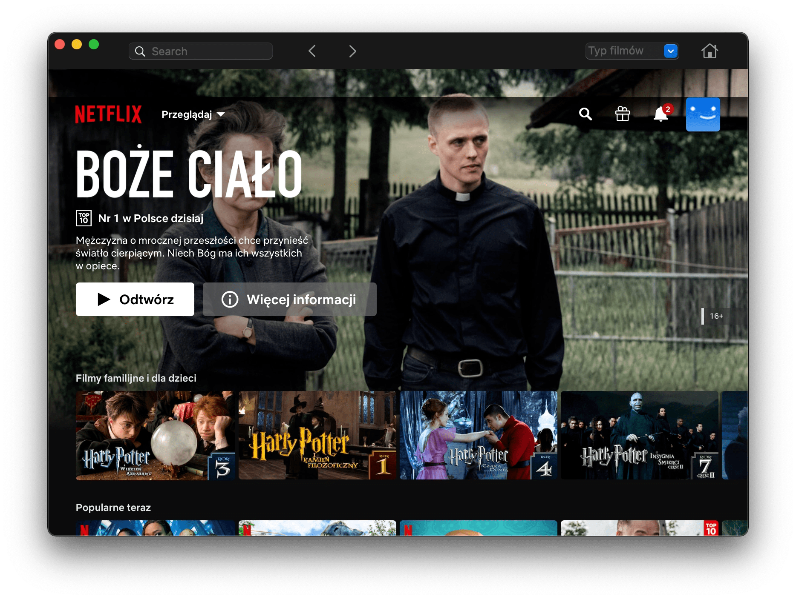
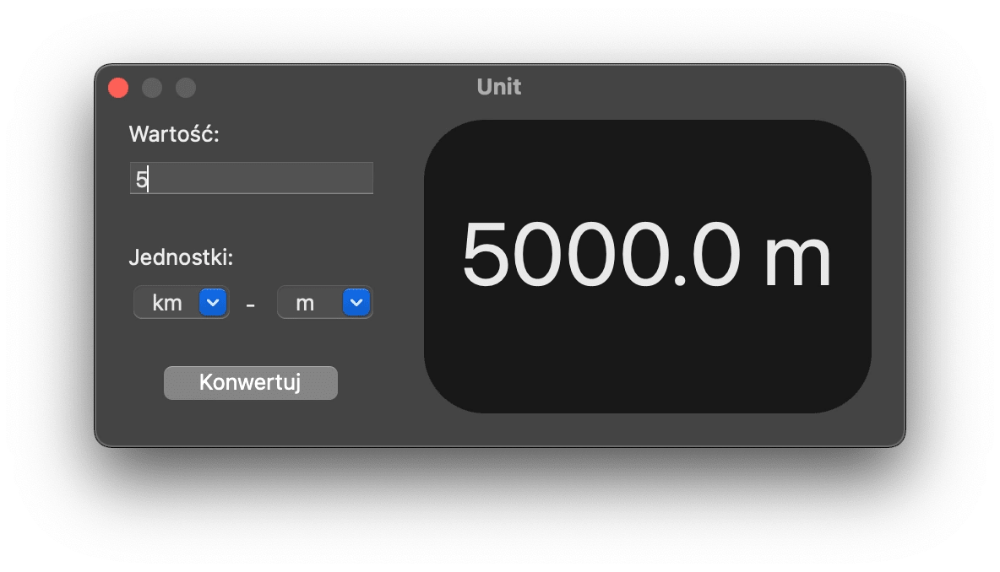
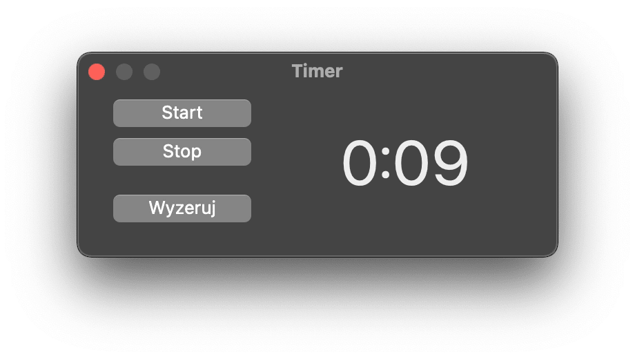

I'm a developer who creates apps mostly in Xcode and Creolabs. You can check what I've created here, on my [GitHub](https://github.com/wiktorwojcik112) and [Twitter profile](https://twitter.com/WiktorW2). 

Here you can find some of my apps. I hope you will like them.

### Macflix

**Macflix** is a simple app that let's you run Netflix without browser. It allows you to simply search Netflix, choose movie categorie and change users.

### Unit

**Unit** is an app that let's you quickly convert units. Currently only length units are available, but I'm working on more.

<INPUT TYPE="button" VALUE="Download Unit Beta 2" onClick="self.location.href=('https://github.com/wiktorwojcik112/Unit/releases/download/beta/Unit.app.zip')">
Supported launguages: polish, english (soon)
  
### Timer

**Timer** is a simple timer that you can acces from dock.
  
<INPUT TYPE="button" VALUE="Download Timer Beta 1" onClick="self.location.href=('https://github.com/wiktorwojcik112/Timer/releases/download/beta/Timer.dmg')">
  Supported launguages: polish, english (soon)
  
### Harmony Browser

**Harmony Browser** is a gorgeous browser for your macOS and iOS devices. It has fresh UI, CPU limiter (so it will not take much of your RAM; coming soon), and is going to have more features soon.
  
  <INPUT TYPE="button" VALUE="Download Harmony Browser for macOS" onClick="self.location.href=('https://github.com/wiktorwojcik112/HarmonyBrowser/releases/download/macOS/Harmony.app.zip')">
  Supported launguages: polish, english
  
  
_More apps coming soon_
